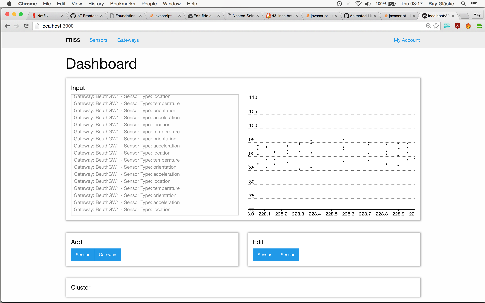

# IoT-Frontend
See all the data

## Installation

You need:
  * node (at least version 4.\*)

installed on your computer.

MAC via homebrew

```
brew install node
```

Linux. I'm just guessing now but:

```
apt-get install nodejs
apt-get install npm
```

Maybe you have to `sudo` it. I don't know.

Windows.

I guess going to the website, download a .exe and doubleclick it.

All set? Good. So on `git clone` this repo.

Make sure to install all important dependencies.

```
npm install
```

You actually have to install `gulp` globally. So run:

```
npm install gulp -g
```

OK. You are almost done. We (I) are using gulp for building our files. So run:

```
gulp init
```

Nice. Now you have all the files where they should be. You have to run 
`gulp init` only this one time. After that `gulp` is enough. If you are really
cool you can run `gulp watch` and it is building everytime when you save a
file.

Now you can run the server with 

```
node .
```

Here again you could be super cool and install `node-dev` and run it.
The server restarts everytime when you save a file.

```
npm install node-dev -g
```

And then run it with:

```
node-dev .
```

In your browser you can visit now `localhost:3000` to see our nice project in action.

## Preview

Here is an old Screenshot:



The data here is:

```
[4, 8, 15, 16, 23, 42]
```
